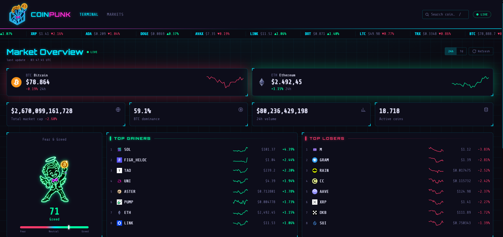
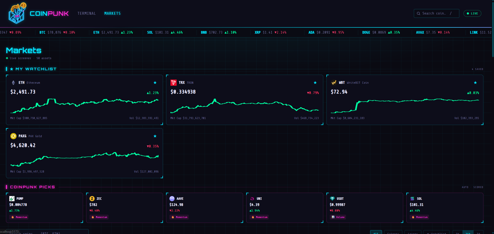
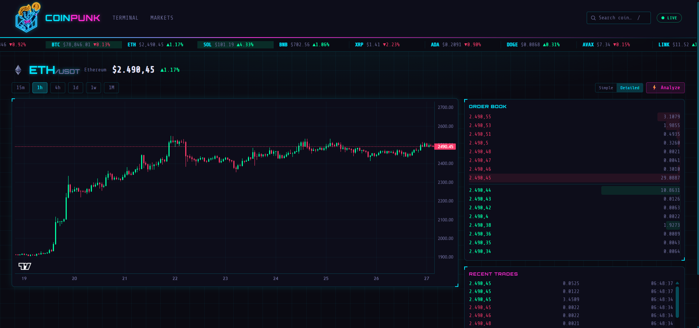
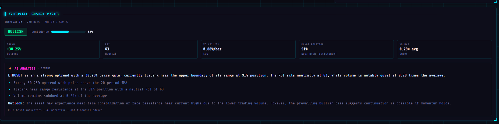
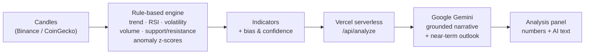

# ⚡ CoinPunk

**A real-time, cyberpunk-themed crypto market terminal with an explainable AI analyst.**

CoinPunk streams live market data, renders a full trading-style terminal for any coin, and — its headline feature — analyzes a coin on demand with an AI that is *grounded on real, transparent indicators* rather than hallucinating from thin air.

🔗 **Live demo:** [coinpunk.vercel.app](https://coinpunk.vercel.app)


---

## Screenshots

> Add your images to a `screenshots/` folder and they will render here.

| Dashboard | Markets screener |
|---|---|
|  |  |

| Coin terminal | AI Signal Analysis |
|---|---|
|  |  |

---

## Overview

CoinPunk is a single-page React application that turns free public market data into a polished, live "terminal" experience — and layers an **explainable AI analyst** on top. It was built as a learning + portfolio project, with a strong focus on real-time data handling, graceful degradation, and a genuinely useful (not gimmicky) AI feature.

## Features

**Dashboard** — Market overview at a glance: BTC/ETH hero cards, global market-cap / dominance / volume stats, top gainers & losers, trending coins, an animated Fear & Greed mascot, a global 24h/7d toggle, and a live scrolling ticker.

**Markets screener** — A sortable, searchable table of the top coins with:
- Quick filters (All / Gainers / Losers / ⭐ Watchlist) and a 1h / 24h / 7d change toggle
- Per-row 7-day sparklines
- **Live prices over WebSocket** with green/red flash on tick
- A **localStorage watchlist** (star coins, no login required) shown as detailed cards
- **COINPUNK Picks** — coins auto-selected by a transparent scoring formula (momentum + volume + breakout), each with a "why it was picked" badge

**Coin terminal** — A per-coin trading view:
- Live candlestick chart (Lightweight Charts) across multiple timeframes
- Real-time **order book** (with depth bars) and **recent trades** over WebSocket
- Robust data layer: request cancellation (`AbortController`), retry-on-transient-error, and clear error states
- **Binance coverage detection** — coins that aren't on Binance gracefully fall back to a **CoinGecko** chart instead of showing a broken error

**⚡ AI Signal Analysis** — the flagship. See the architecture below.

**Design & UX** — Custom cyberpunk theme (neon cyan/magenta, glitch effects, a Matrix "rabbit hole" loading screen, an animated mascot), full responsive/mobile layout, keyboard focus rings, and `prefers-reduced-motion` support.

---

## The AI: grounded, explainable analysis

Most "AI crypto analysis" tools ask a language model to invent an opinion. CoinPunk does the opposite: a deterministic engine computes the numbers first, and the LLM is only allowed to *narrate those numbers*.



1. **A — Rule-based engine** (`src/lib/analysis.js`): pure functions turn the loaded candles into interpretable indicators (trend, RSI, volatility, volume ratio, range position, anomaly z-scores) plus a transparent **bias** and **confidence** score. This is genuinely explainable — every conclusion traces back to a number.
2. **B — LLM narrator** (`api/analyze.js`): those indicators are sent to **Google Gemini** through a secure Vercel serverless function. The prompt instructs the model to reason **only** from the provided numbers, then produce a plain-English analysis, a hedged outlook, and key points. Supports **Simple / Detailed** modes.

The API key never touches the browser — it lives as a server-side environment variable, and the function adds retry + a fallback model for transient overloads. The panel shows both the raw indicators *and* the AI narrative side by side.

> ⚠️ CoinPunk's analysis is a rule-based + AI signal summary for educational purposes — **not financial advice.**

---

## Tech stack

- **Frontend:** React 19, React Router 7, Vite 8
- **Styling:** Tailwind CSS 4 (custom `@theme` cyberpunk tokens)
- **Charts:** Lightweight Charts 5
- **Data:** Binance REST + WebSocket (klines, ticker, depth, trades), CoinGecko (markets, global, trending, OHLC fallback, coin metadata), alternative.me (Fear & Greed)
- **AI backend:** Vercel serverless function → Google Gemini API
- **Hosting:** Vercel

---

## Getting started

### Prerequisites
- Node.js 18+
- A free [CoinGecko demo API key](https://www.coingecko.com/en/api)
- A free [Google AI Studio (Gemini) API key](https://aistudio.google.com/apikey) — only needed for the AI feature

### Install & run

```bash
git clone https://github.com/kaankygn/cyrpto-market.git
cd cyrpto-market
npm install
npm run dev
```

### Environment variables

Create a `.env` file in the project root:

```bash
# CoinGecko demo key (frontend)
VITE_COINGECKO_KEY=your_coingecko_demo_key

# Optional: point local dev at the deployed AI function
# (the serverless function only runs on Vercel, not in `vite dev`)
VITE_API_BASE=https://coinpunk.vercel.app
```

The Gemini key is **not** a frontend variable — set `GEMINI_KEY` in your Vercel project's Environment Variables so the serverless function can read it securely.

### Build

```bash
npm run build
npm run preview
```

---

## Project structure

```
api/
  analyze.js          # Vercel serverless function → Gemini (grounded AI)
src/
  api/                # REST clients (Binance, CoinGecko, Fear & Greed)
  hooks/              # WebSocket hooks (ticker, kline, order book, trades, live prices)
  lib/analysis.js     # Rule-based indicator engine (the "A" layer)
  components/         # Navbar, Ticker, charts, panels, mascots, loading/error states
  pages/              # Dashboard, Markets, CoinDetail
  index.css           # Cyberpunk theme + animations
vercel.json           # SPA fallback rewrite
```

---

## Notes

- Built on free public API tiers; not intended for commercial use as-is.
- Live order book / trades are only available for coins listed on Binance; other coins fall back to CoinGecko chart data.

---

Made with cyan, magenta, and too many neon glows.
